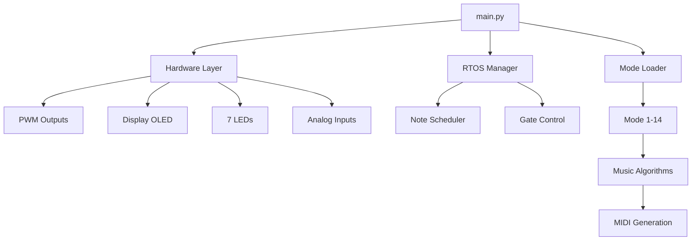

# 🔧 TECLA - GUIA TÈCNICA DE DESENVOLUPAMENT

> **Audiència:** Desenvolupadors i programadors que volen entendre l'arquitectura interna, crear nous modes musicals i modificar el sistema TECLA.

---

## 📋 TAULA DE CONTINGUTS

1. [Arquitectura del Sistema](#arquitectura-del-sistema)
2. [Sistema RTOS](#sistema-rtos)
3. [Creació de Modes Musicals](#creació-de-modes-musicals)
4. [Sistema d'Animacions](#sistema-danimacions)
5. [API del Hardware](#api-del-hardware)
6. [Configuració i Persistència](#configuració-i-persistència)

---

## 🏗️ ARQUITECTURA DEL SISTEMA

### Estructura de Carpetes

```
D:\
├── main.py                  # Bucle principal RTOS
├── core/                    # Components del sistema
│   ├── hardware.py          # Abstracció hardware (LEDs, PWM, Display)
│   ├── config.py            # Configuració global
│   ├── rtos.py              # Gestor RTOS (timing crític)
│   ├── clock.py             # Master Clock (BPM, ticks)
│   ├── button_handler.py    # Gestió de botons
│   ├── midi_handler.py      # MIDI I/O
│   └── calibration.py       # ​Calibració CV
├── modes/                   # Modes musicals
│   └── loader.py            # Carregador de modes
├── display/                 # Sistema visual
│   ├── screens.py           # Pantalles i imatges
│   └── animations.py        # Animacions
├── music/                   # Utilitats musicals
│   ├── algorithms.py        # Algorismes generatius
│   └── converters.py        # Conversions (V→BPM, MIDI, etc.)
└── config/                  # Persistència
    └── tecla_config.json    # Configuració guardada
```

### Flux de Dades



---

## ⚙️ SISTEMA RTOS

### Concepte

El TECLA utilitza un **RTOS (Real-Time Operating System) lightweight** implementat amb prioritats de tasques:

| Prioritat | Tasca | Freqüència |
|-----------|-------|------------|
| **MÀXIMA** | RTOS Update (gate timing) | Cada loop (~500µs) |
| **ALTA** | Button polling | Cada 5ms |
| **MITJANA** | Mode execution | Segons BPM |
| **BAIXA** | Display update | Cada 150ms |

### Code: `core/rtos.py`

```python
class RTOSManager:
    def update(self, current_time):
        """Crida prioritària - NO bloquejar mai"""
        # 1. Verificar si cal apagar notes (Note Off)
        if self.active_notes and current_time >= self.note_off_time:
            self._execute_note_off()
        
        # 2. Verificar si cal apagar gate
        if self.gate_active and current_time >= self.gate_end_time:
            self.hw.gate.value = False
            self.gate_active = False
```

**⚠️ REGLA CRÍTICA:** Mai bloquejar dins `rtos.update()`. Sempre execucions `< 100µs`.

### Timing de Notes

```python
# En main.py - Execució de mode
ticks = clock.consume_ticks(current_time)
for tick_time in ticks:
    cfg.next_note_time = tick_time + sleep_time
    mode_loader.execute_mode(mode, x, y, sleep_time, cx, cy)
```

**Concepte de Ticks:**

- El `MasterClock` genera "ticks" basats en BPM
- Cada tick = 1 beat musical
- Els modes consumeixen ticks i generen notes

---

## 🎵 CREACIÓ DE MODES MUSICALS

### Pas 1: Afegir Mode a `modes/loader.py`

```python
def execute_mode(self, mode, x, y, sleep_time, cx, cy):
    """Carregador de modes"""
    if mode == 15:  # NOU MODE
        self._mode_nou_mode(x, y, sleep_time)
    # ... altres modes
```

### Pas 2: Implementar Mètode del Mode

```python
def _mode_nou_mode(self, x, y, sleep_time):
    """
    PLANTILLA PER NOU MODE
    
    Args:
        x: CV1 (0.0-3.3V calibrat)
        y: CV2 (0.0-3.3V calibrat)
        sleep_time: Temps entre notes (segons)
    """
    # 1. PROCESSAR PARÀMETRES
    param1 = int(map_value(x, 0, 3.3, 1, 10))  # CV1 → 1-10
    param2 = int(map_value(y, 0, 3.3, 0, 127))  # CV2 → 0-127
    
    # 2. GENERAR NOTA (MIDI 0-127)
    nota = self.cfg.nota_base + param1
    nota = max(0, min(127, nota))  # Clamp
    
    # 3. CONFIGURAR PWM (opcions)
    
    # Opció A: Nota única (PWM1)
    freq = midi_to_freq(nota)
    duty = self.cfg.duty1
    self.hw.set_pwm_note(freq, duty, channel=1)
    
    # Opció B: Harmònics (PWM1 + PWM2 + PWM3)
    self.hw.set_pwm_note(midi_to_freq(nota), self.cfg.duty1, channel=1)
    self.hw.set_pwm_note(midi_to_freq(nota + 4), self.cfg.duty2, channel=2)  # Tercera
    self.hw.set_pwm_note(midi_to_freq(nota + 7), self.cfg.duty3, channel=3)  # Quinta
    
    # 4. GATE ON
    self.hw.gate.value = True
    gate_duration = sleep_time * 0.8  # 80% del beat
    
    # 5. PROGRAMAR NOTE OFF (RTOS)
    self.rtos.schedule_note_off(time.monotonic() + gate_duration)
    
    # 6. MIDI OUT (opcional)
    if self.cfg.midi_out_enabled:
        self.midi_handler.note_on(nota, velocity=100)
    
    # 7. GUARDAR ESTAT
    self.cfg.nota_actual = nota
    self.cfg.nota_tocada_ara = True  # Per animacions
```

### Pas 3: Afegir a la Llista de Modes

Edita `core/hardware.py` - `update_loop_mode_indicators()`:

```python
patterns = {
    # ... existents
    15: (True, True, True),  # Nou mode (binari: 1111)
}
```

### Pas 4: Afegir Imatge del Mode

Edita `display/screens.py` - `_dibuixar_imatge_gran()`:

```python
elif mode == 15:  # Nou mode - Descripció visual
    # Dibuixar imatge procedural (píxels, línies, cercles)
    for x in range(0, 128, 4):
        y = int(32 + 20 * math.sin(x * 0.1))
        self.hw.display.pixel(x, y, 1)
```

---

## 🎨 SISTEMA D'ANIMACIONS

### Tipus d'Animacions

#### 1. **Animació d'Ull (Mode 0 - Idle)**

```python
# display/animations.py
def animacion_ojo(self):
    """Animació de 60 frames (30 segons)"""
    fase = int((time.monotonic() * 10) % 300)  # 300 frames
    
    if fase >= 0 and fase < 20:
        # Part 1: Despertar
        pass
    elif fase >= 20 and fase < 270:
        # Part 2: Moviment suau
        pass
    elif fase >= 270:
        # Part 3: Glitch èpic
        pass
```

#### 2. **Animació de Raig (Mode CAOS)**

```python
def dibujar_rayo_simple(self):
    """Raig que travessa la pantalla"""
    x, y = 64, 0
    for i in range(10):
        dx = random.randint(-10, 10)
        dy = random.randint(4, 8)
        self.hw.display.line(x, y, x + dx, y + dy, 1)
        x, y = x + dx, y + dy
```

### Integració al Main Loop

```python
# main.py - línia ~261
if cfg.caos == 1 and cfg.nota_tocada_ara:
    screen.mostrar_info_loop_mode()
    anim.dibujar_rayo_simple()  # ← CRIDA ANIMACIÓ
    hw.display.show()
    cfg.nota_tocada_ara = False
```

### Crear Nova Animació

1. Afegir mètode a `display/animations.py`
2. Cridar des de `main.py` amb condició
3. **IMPORTANT:** Sempre acabar amb `self.hw.display.show()`

```python
def nova_animacio(self):
    """Nova animació personalitzada"""
    self.hw.display.fill(0)  # Netejar
    
    # Dibuixar elements
    self.hw.display.circle(64, 32, 20, 1)
    self.hw.display.text("TECLA", 45, 28, 1)
    
    self.hw.display.show()  # ← CRÍTIC!
```

---

## 🔌 API DEL HARDWARE

### Classe `TeclaHardware` (`core/hardware.py`)

#### PWM Control

```python
# Configurar nota en PWM
def set_pwm_note(self, freq_hz, duty_percent, channel=1):
    """
    Args:
        freq_hz: Freqüència en Hz (exemple: 440.0 per La4)
        duty_percent: 1-99 (50 = ona quadrada perfecta)
        channel: 1, 2 o 3 (PWM1, PWM2, PWM3)
    """
    
# Apagar PWM
hw.pwm1.duty_cycle = 0
hw.pwm2.duty_cycle = 0
hw.pwm3.duty_cycle = 0
```

#### LEDs

```python
# Encendre LED individual
hw.led_2.value = True  # Gate LED

# Encendre tots
hw.all_leds_on()

# Apagar tots
hw.all_leds_off()

# Llista de LEDs: hw.leds[0-6]
```

#### Display OLED (128×64)

```python
# Píxel individual
hw.display.pixel(x, y, 1)  # 1=blanc, 0=negre

# Línia
hw.display.line(x0, y0, x1, y1, 1)

# Cercle
hw.display.circle(cx, cy, radius, 1)

# Rectangle
hw.display.rect(x, y, width, height, 1)

# Text
hw.display.text("Hola", x, y, 1)

# Actualitzar pantalla (SEMPRE NECESSARI!)
hw.display.show()
```

#### Entrades Analògiques

```python
# Llegir voltatge (0.0-3.3V)
z = hw.get_voltage(hw.slider)       # Slider (GP28)
x = hw.get_voltage(hw.cv1_pote)     # CV1 (GP26)
y = hw.get_voltage(hw.cv2_ldr)      # CV2 (GP27)

# Aplicar calibració
from music.converters import get_voltage_calibrated
x_cal = get_voltage_calibrated(x, cfg.cv1_min, cfg.cv1_max)
```

---

## 💾 CONFIGURACIÓ I PERSISTÈNCIA

### Objecte `cfg` (`core/config.py`)

Tots els paràmetres globals:

```python
# Musicals
cfg.loop_mode = 1          # Mode actiu (0-14)
cfg.octava = 5             # Octava (0-10)
cfg.bpm = 120              # BPM (20-220)
cfg.nota_actual = 60       # Última nota (MIDI)

# Harmònics
cfg.freqharm_base = 0      # Harmònic PWM1 (0-12)
cfg.freqharm1 = 4          # Harmònic PWM2 (0-12)
cfg.freqharm2 = 7          # Harmònic PWM3 (0-12)

# Duty Cycles
cfg.duty1 = 50             # PWM1 (1-99%)
cfg.duty2 = 50             # PWM2 (1-99%)
cfg.duty3 = 50             # PWM3 (1-99%)

# Calibració CV
cfg.cv1_min = 0.0          # Voltatge mínim CV1
cfg.cv1_max = 3.3          # Voltatge màxim CV1
cfg.cv2_min = 0.0          # Igual per CV2
cfg.cv2_max = 3.3

# Estat
cfg.caos = 0               # Mode CAOS (0=off, 1=on)
cfg.playing_notes = []     # Notes actives (MIDI handler)
```

### Guardar Configuració

```python
# config/config_manager.py
def save_config(cfg):
    """Guarda a config/tecla_config.json"""
    data = {
        "loop_mode": cfg.loop_mode,
        "octava": cfg.octava,
        # ... tots els paràmetres
    }
    with open("config/tecla_config.json", "w") as f:
        json.dump(data, f)
```

**Auto-guardat:** Es crida automàticament en canvis de paràmetres.

---

## 🎓 EXEMPLE COMPLET: MODE PERSONALITZAT

### Mode "Glitch Beat" - Ritme amb errors aleatoris

```python
# A modes/loader.py

def _mode_glitch_beat(self, x, y, sleep_time):
    """
    Mode 15: GLITCH BEAT
    Ritme regular amb glitches aleatoris
    
    CV1: Probabilitat de glitch (0-100%)
    CV2: Intensitat del glitch (canvi de nota)
    """
    from music.converters import map_value, midi_to_freq
    import random
    
    # Paràmetres
    glitch_prob = map_value(x, 0, 3.3, 0.0, 1.0)  # 0-100%
    glitch_intensity = int(map_value(y, 0, 3.3, 1, 12))  # 1-12 semitons
    
    # Ritme base (kick cada 4 beats)
    is_kick = (self.cfg.iteration % 4 == 0)
    nota_base = self.cfg.nota_base - 24 if is_kick else self.cfg.nota_base
    
    # Aplicar glitch?
    if random.random() < glitch_prob:
        offset = random.randint(-glitch_intensity, glitch_intensity)
        nota = nota_base + offset
        duty = random.randint(10, 90)  # Duty aleatori
    else:
        nota = nota_base
        duty = 50
    
    # Tocar nota
    nota = max(0, min(127, nota))
    freq = midi_to_freq(nota)
    self.hw.set_pwm_note(freq, duty, channel=1)
    self.hw.gate.value = True
    
    # Programar Note Off
    gate_len = sleep_time * 0.5
    self.rtos.schedule_note_off(time.monotonic() + gate_len)
    
    self.cfg.nota_actual = nota
```

---

## 📚 RECURSOS ADDICIONALS

### Conversors Útils (`music/converters.py`)

```python
# MIDI → Freqüència
freq = midi_to_freq(60)  # C4 = 261.63 Hz

# Voltatge → BPM
bpm = voltage_to_bpm(voltage, pot_min, pot_max, bpm_min, bpm_max)

# Mapatge de rangs
valor = map_value(input, in_min, in_max, out_min, out_max)

# Nom de nota
nom = midi_to_note_name(60)  # "C4"
```

### Algorismes Musicals (`music/algorithms.py`)

```python
# Distribució Euclidiana
pattern = euclidean_rhythm(pulsos=5, steps=16)  # [1,0,0,1,0,0,1,0,...]

# Escales modals
escala = MODES_SCALE[mode_index]  # [0,2,4,5,7,9,11] per Jònic
```

---

## ⚠️ PITFALLS COMUNS

### 1. **Bloquejar el RTOS**

❌ **MAL:**

```python
time.sleep(1.0)  # Bloqueja tot el sistema!
```

✅ **BÉ:**

```python
self.rtos.schedule_callback(time.monotonic() + 1.0, callback)
```

### 2. **No cridar `display.show()`**

❌ **MAL:**

```python
hw.display.text("Hola", 0, 0, 1)
# No es veu res!
```

✅ **BÉ:**

```python
hw.display.text("Hola", 0, 0, 1)
hw.display.show()  # Actualitza pantalla
```

### 3. **Notes que no s'apaguen**

❌ **MAL:**

```python
hw.set_pwm_note(440, 50, 1)
# Nota infinita!
```

✅ **BÉ:**

```python
hw.set_pwm_note(440, 50, 1)
self.rtos.schedule_note_off(time.monotonic() + duration)
```

---

## 🚀 COMPILACIÓ I DEPLOY

1. Copiar tots els fitxers a la unitat `CIRCUITPY`
2. El fitxer `main.py` s'executa automàticament
3. Observar consola serial per debug: `print("Debug info")`
4. Reset: Prem botó `BOOTSEL` o executa `reset.py`

---

**Happy Coding! 🎵✨**
